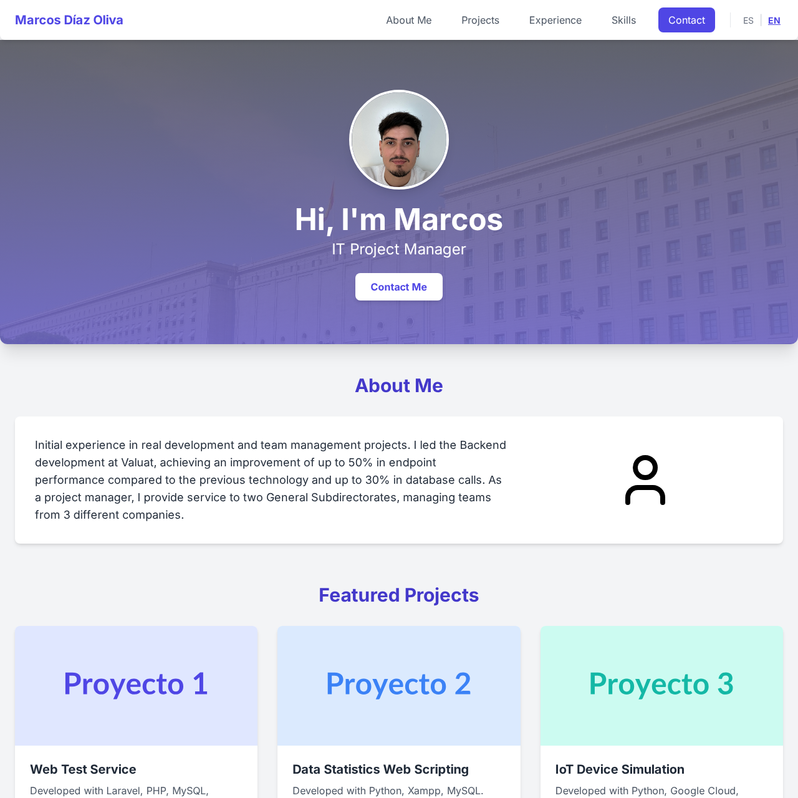

# 📌 Portfolio - Marcos Díaz Oliva

[](https://app.netlify.com/sites/curious-elf-e83b01/deploys)


---

## English Version

### 🌐 Project Overview

Professional responsive portfolio with multilingual support (ES/EN) showcasing my proffesional experience and personal development.



### ✨ Key Features

- ✅ Fully responsive design
- 🌍 Bilingual support (ES/EN)
- 📝 Functional contact form
- 🚀 Performance optimized
- 📱 Interactive mobile menu
- ✨ Modern visual effects

### 🛠 Technology Stack

| Frontend          | Backend         | Tools            |
|-------------------|-----------------|------------------|
| Semantic HTML5    | Netlify Forms   | Git + GitHub     |
| Tailwind CSS      |                 | Lucide Icons     |
| JavaScript ES6+   |                 | Google Analytics |
| Responsive Design |                 | Figma (Design)   |

### 📂 Project Structure

```bash
.
├── index.html          # Index page
├── contact.html        # Contact page
├── assets/
│   ├── css/            # CSS files
│   │   ├── main.css
│   │   └── contact.css
│   └── js/            # JavaScript files
│       ├── main.js
│       ├── language.js
│       └── contact.js
├── documents/          # Downloadable files
│   ├── CV_ES.pdf
│   └── CV_EN.pdf
└── images/             # Visual assets
    ├── preview.jpg
    └── personal.jpg
```

### 🚀 Getting Started
```bash
git clone https://github.com/diazoliva/portfolio.git
cd portfolio
```

## Versión Española

### 🌐 Introducción al Proyecto

Portfolio profesional responsive con soporte multidioma (ES/EN) que muestra mi experiencia profesional y desarrollo personal.


### ✨ Características

- ✅ Diseño 100% responsive
- 🌍 Soporte bilingüe (ES/EN)
- 📝 Formulario de contacto funcional
- 🚀 Optimizado para rendimiento
- 📱 Menú móvil interactivo
- ✨ Efectos visuales modernos

### 🛠 Stack Tecnológico

| Frontend          | Backend         | Herramientas       |
|-------------------|-----------------|--------------------|
| HTML5 Semántico   | Netlify Forms   | Git + GitHub       |
| Tailwind CSS      |                 | Lucide Icons       |
| JavaScript ES6+   |                 | Google Analytics   |
| Responsive Design |                 | Figma (Diseño)     |

### 📂 Estructura del Proyecto

```bash
.
├── index.html          # Página principal
├── contact.html        # Página de contacto
├── assets/
│   ├── css/            # Hojas de estilo
│   │   ├── main.css
│   │   └── contact.css
│   └── js/            # Scripts
│       ├── main.js
│       ├── language.js
│       └── contact.js
├── documents/          # Archivos descargables
│   ├── CV_ES.pdf
│   └── CV_EN.pdf
└── images/             # Recursos visuales
    ├── preview.jpg
    └── personal.jpg
```

### 🚀 Comienzo
```bash
git clone https://github.com/diazoliva/portfolio.git
cd portfolio
```