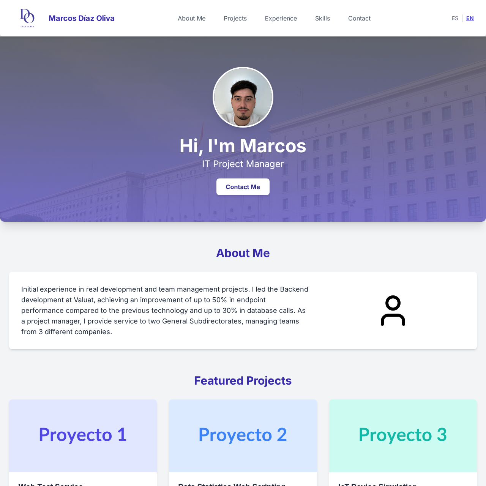

# 📌 Portfolio - Marcos Díaz Oliva

[](https://app.netlify.com/sites/curious-elf-e83b01/deploys)


---

## English Version

### 🌐 Project Overview

Professional responsive portfolio with multilingual support (ES/EN) showcasing my proffesional experience and personal development.



### ✨ Key Features

- ✅ Fully responsive design
- 🌍 Bilingual support (ES/EN)
- 📝 Functional contact form
- 🚀 Performance optimized
- 📱 Interactive mobile menu
- ✨ Modern visual effects

### 🛠 Technology Stack

| Frontend          | Backend         | Tools            |
|-------------------|-----------------|------------------|
| Semantic HTML5    | Netlify Forms   | Git + GitHub     |
| Tailwind CSS      |                 | Lucide Icons     |
| JavaScript ES6+   |                 | Google Analytics |
| Responsive Design |                 | Figma (Design)   |

### 📂 Project Structure

```bash
.
├── assets/
│   ├── documents/
│   │   ├── CV_ES.pdf
│   │   └── CV_EN.pdf
│   └── images/
│       ├── preview.jpg
│       └── personal.jpg
├── components/
│   ├── ContactForm.js
│   ├── Footer.js
│   ├── LanguageSwitcher.js
│   └── Navbar.js
├── github/
│   └── preview_EN.png
├── pages/
│   ├── Contact.js
│   └── Home.js
├── scripts/
│   └── main.js
├── styles/
│   ├── components/
│   │   ├── contact.css
│   │   ├── footer.css
│   │   └── navbar.css
│   ├── base.css
│   └── utilities.css
├── utils/
│   ├── constants.js
│   └── language.js
├── App.js
├── index.html
└── Readme.md
```

### 🚀 Getting Started
```bash
git clone https://github.com/diazoliva/portfolio.git
cd portfolio
```

## Versión Española

### 🌐 Introducción al Proyecto

Portfolio profesional responsive con soporte multidioma (ES/EN) que muestra mi experiencia profesional y desarrollo personal.


### ✨ Características

- ✅ Diseño 100% responsive
- 🌍 Soporte bilingüe (ES/EN)
- 📝 Formulario de contacto funcional
- 🚀 Optimizado para rendimiento
- 📱 Menú móvil interactivo
- ✨ Efectos visuales modernos

### 🛠 Stack Tecnológico

| Frontend          | Backend         | Herramientas       |
|-------------------|-----------------|--------------------|
| HTML5 Semántico   | Netlify Forms   | Git + GitHub       |
| Tailwind CSS      |                 | Lucide Icons       |
| JavaScript ES6+   |                 | Google Analytics   |
| Responsive Design |                 | Figma (Diseño)     |

### 📂 Estructura del Proyecto

```bash
.
├── assets/
│   ├── documents/
│   │   ├── CV_ES.pdf
│   │   └── CV_EN.pdf
│   └── images/
│       ├── preview.jpg
│       └── personal.jpg
├── components/
│   ├── ContactForm.js
│   ├── Footer.js
│   ├── LanguageSwitcher.js
│   └── Navbar.js
├── github/
│   └── preview_EN.png
├── pages/
│   ├── Contact.js
│   └── Home.js
├── scripts/
│   └── main.js
├── styles/
│   ├── components/
│   │   ├── contact.css
│   │   ├── footer.css
│   │   └── navbar.css
│   ├── base.css
│   └── utilities.css
├── utils/
│   ├── constants.js
│   └── language.js
├── App.js
├── index.html
└── Readme.md
```

### 🚀 Comienzo
```bash
git clone https://github.com/diazoliva/portfolio.git
cd portfolio
```